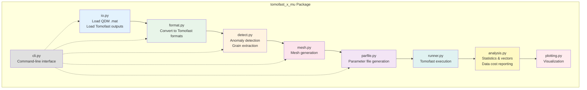
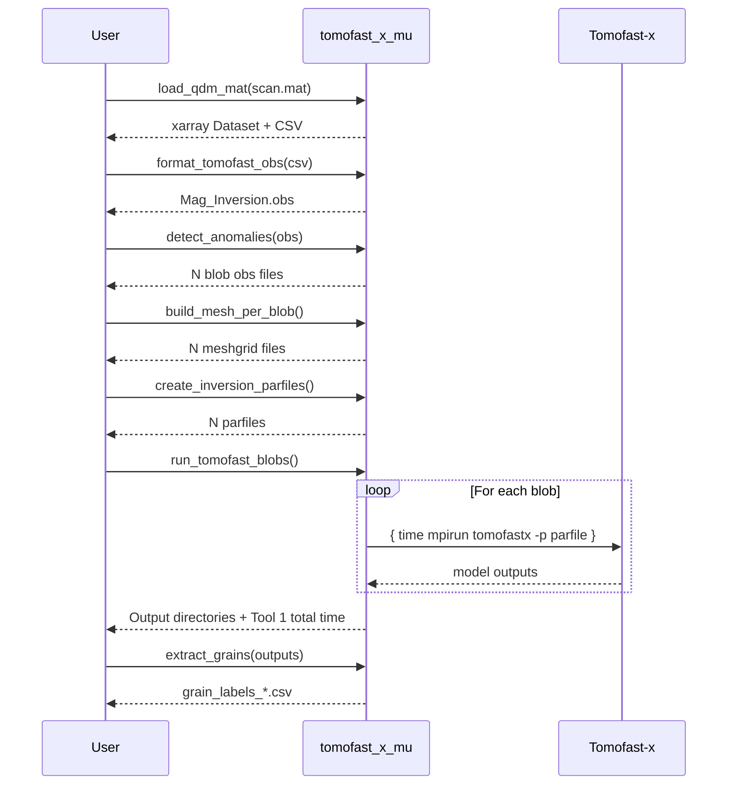
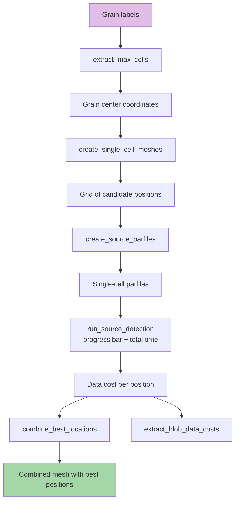
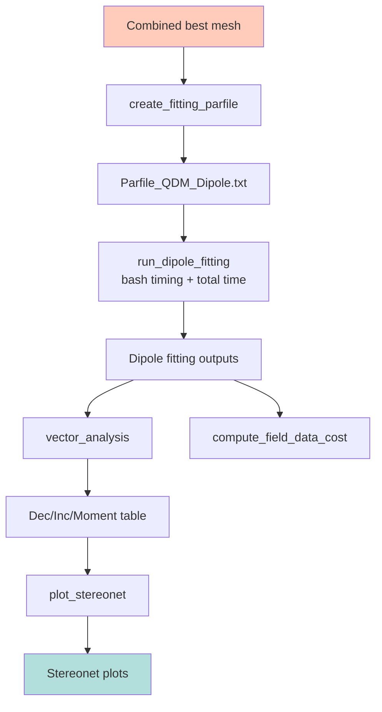

# Tomofast-µ Documentation

Complete documentation for the tomofast_x_mu Python package for quantum diamond microscope (QDM) magnetic microscopy inversion.

## Table of Contents

1. [Overview](#overview)
2. [Installation](#installation)
3. [Architecture](#architecture)
4. [Workflow](#workflow)
5. [API Reference](#api-reference)
6. [Units Convention](#units-convention)
7. [Examples](#examples)
8. [Troubleshooting](#troubleshooting)

## Overview

**tomofast_x_mu** is a Python package that implements data preparation, meshing, post-processing, and plotting for the Tomofast-x-µ workflow. It bridges the gap between QDM magnetic microscopy scans and 3D magnetic inversion using Tomofast-x.

### What It Does

- Loads QDM `.mat` files and converts to Tomofast-compatible formats
- Detects magnetic anomalies (blobs) in field maps
- Generates adaptive meshes and parameter files for each anomaly
- Orchestrates Tomofast-x inversions via MPI
- Extracts 3D grain labels from inversion results
- Performs source location detection via grid search
- Computes magnetization vectors (declination/inclination) and dipole moments
- Generates publication-quality plots and stereonets

### What It Doesn't Do

- **Tomofast-x itself is external** — you need to install the MPI-based Tomofast-x solver separately
- This package focuses on the Python workflow around Tomofast-x

## Installation

### Basic Installation

```bash
cd tomofast_x_mu
pip install -e .
```

### Development Installation

```bash
pip install -e ".[dev]"
python -m pytest -q
```

### External Requirements

To run actual inversions:
- **Tomofast-x** executable (see [Tomofast-x repository](https://github.com/TOMOFAST/Tomofast-x))
- **MPI runtime** (OpenMPI, MPICH, or similar)

The Python package works without these for preprocessing and analysis.

## Architecture

### Package Structure



### Data Flow

```mermaid
flowchart LR
    MAT[QDM .mat file] --> LOAD[load_qdm_mat]
    LOAD --> CSV[CSV file]
    LOAD --> DS[xarray Dataset]

    CSV --> FMT[format_tomofast_obs]
    FMT --> OBS[Mag_Inversion.obs]

    OBS --> DET[detect_anomalies]
    DET --> BLOB_OBS[Blob_XXX_RECT.obs]
    DET --> WINDOWS[blob_windows.txt]

    WINDOWS --> MESH_BUILD[build_mesh_per_blob]
    MESH_BUILD --> MESHGRID[Meshgrid_Blob_XXX.txt]

    MESHGRID --> PAR_CREATE[create_inversion_parfiles]
    PAR_CREATE --> PARFILES[Parfile_QDM_Inversion_Blob_XXX.txt]

    PARFILES --> RUN_TF[run_tomofast_blobs]
    BLOB_OBS --> RUN_TF
    MESHGRID --> RUN_TF
    RUN_TF --> TF_OUT[Tomofast outputs]

    TF_OUT --> EXTRACT[extract_grains]
    EXTRACT --> GRAINS[grain_labels_*.csv]

    GRAINS --> STATS[grain_statistics]
    STATS --> RESULTS[Statistics DataFrame]

    style MAT fill:#ffcdd2
    style DS fill:#c5e1a5
    style OBS fill:#fff9c4
    style TF_OUT fill:#b2dfdb
    style RESULTS fill:#ce93d8
```



## Workflow

The complete workflow consists of three main stages:

### Stage 1: 3D Inversion

Detect anomalies, create meshes, run inversions, extract 3D grains.



### Stage 2: Source Location Detection

Grid search to find optimal dipole positions.



### Stage 3: Vector Direction & Intensity

Fit dipoles at optimal locations, compute magnetization vectors.



## API Reference

### I/O Functions

#### `load_qdm_mat(path, save_csv=True, csv_path=None, *, h_units='auto')`

Load QDM microscopy data from MATLAB `.mat` file.

**Parameters:**
- `path` (str | Path): Path to `.mat` file
- `save_csv` (bool): Save as CSV (default: True)
- `csv_path` (str | Path | None): CSV output path
- `h_units` ({'m', 'um', 'auto'}): Units of sensor distance `h`

**Returns:** `xarray.Dataset` with `bz(y, x)` field in nT, coordinates in µm

**Example:**
```python
ds = tfmu.load_qdm_mat("scan.mat", h_units="auto")
print(ds.bz.shape)  # (ny, nx)
```

#### `load_field_table(path, names=None)`

Load Tomofast field table (observed/calculated/residual data).

**Parameters:**
- `path` (str): Path to field table file
- `names` (list[str] | None): Column names

**Returns:** `pandas.DataFrame`

#### `read_mesh_bounds(mesh_path)`

Read mesh bounds and cell centers from Tomofast meshgrid file.

**Parameters:**
- `mesh_path` (str): Path to meshgrid file

**Returns:** `dict` with keys: `x_centers`, `y_centers`, `z_centers`, `mesh`, `nx`, `ny`, `nz`

### Format Functions

#### `format_tomofast_obs(csv_path, out_path, flip_bz=True, x_start=None, x_end=None, y_start=None, y_end=None)`

Convert CSV to Tomofast observation file format.

**Parameters:**
- `csv_path` (str): Input CSV path (x, y, z, bz columns)
- `out_path` (str): Output `.obs` file path
- `flip_bz` (bool): Flip Bz sign for Tomofast convention (default: True)
- `x_start`, `x_end`, `y_start`, `y_end` (int | None): Optional clipping bounds

**Returns:** `dict` with `x_coords`, `y_coords`, `bz`, `nx`, `ny`

#### `write_obs(out_path, header, arr)`

Write observation file with updated data count in header.

#### `write_meshgrid_tomofast(filename, line_data)`

Write Tomofast meshgrid file (3-component model format).

### Detection Functions

#### `detect_anomalies(obs_path, threshold_factor=2.75, pad_x=40, pad_y=10, min_blob_cells=150, max_blob_cells=100000, nz_fixed=120, out_obs_dir=None, windows_path=None, summary_path=None)`

Detect magnetic anomalies (blobs) in observation data.

**Parameters:**
- `obs_path` (str): Path to observation file
- `threshold_factor` (float): Threshold = factor × std(Bz)
- `pad_x`, `pad_y` (int): Padding cells around detected blobs
- `min_blob_cells`, `max_blob_cells` (int): Size filters
- `nz_fixed` (int): Fixed Z dimension for meshes
- `out_obs_dir` (str | None): Directory for per-blob obs files
- `windows_path` (str | None): Path to save blob window coordinates
- `summary_path` (str | None): Path to save blob summary

**Returns:** `list[dict]` with blob metadata

#### `extract_grains(blob_root, threshold_list=None, structure=None)`

Extract 3D grain labels from inversion outputs using thresholding.

**Parameters:**
- `blob_root` (str): Root folder containing `Blob_XXX` subfolders
- `threshold_list` (array-like | None): Fractional thresholds (default: 0.1 to 0.9)
- `structure` (ndarray | None): Connectivity structure for labeling

**Returns:** `dict` mapping `(blob, threshold)` → CSV path

#### `extract_max_cells(blob_root, mesh_root, threshold_list=None, target_grain_ids=None, tol=1e-6)`

Find maximum-amplitude mesh cell per grain per threshold.

**Returns:** `dict` mapping `(blob, threshold)` → txt file path

### Mesh Functions

#### `make_edges(x_min, x_max, n_core, dx_core, n_pad, growth_factor=1.2)`

Generate 1D mesh edges with uniform core and geometric padding.

**Parameters:**
- `x_min`, `x_max` (float): Core region bounds
- `n_core` (int): Number of core cells
- `dx_core` (float): Core cell size
- `n_pad` (int): Number of padding cells on each side
- `growth_factor` (float): Geometric growth factor for padding

**Returns:** `numpy.ndarray` of edge coordinates

#### `build_mesh_per_blob(windows_path, out_dir, summary_path, npad_x=20, npad_y=20, nz=120, dz0=4.4)`

Build meshes for all detected blobs.

**Parameters:**
- `windows_path` (str): Path to blob windows file
- `out_dir` (str): Output directory for meshgrid files
- `summary_path` (str): Path to save mesh summary
- `npad_x`, `npad_y` (int): Padding cells in X/Y
- `nz` (int): Number of Z cells
- `dz0` (float): First Z cell thickness (µm)

**Returns:** `list[str]` of meshgrid file paths

#### `create_single_cell_meshes(blob_root, mesh_root, out_root, dx=4.4, dy=4.4, dz=4.4, threshold_list=None)`

Create single-cell meshes at grain center positions for source detection.

**Returns:** `dict` mapping `(blob, grain, threshold)` → mesh directory

### Parfile Functions

#### `create_inversion_parfiles(summary_path, out_dir)`

Create Tomofast parameter files for 3D inversion of each blob.

**Parameters:**
- `summary_path` (str): Path to mesh summary file
- `out_dir` (str): Output directory for parfiles

**Returns:** `list[str]` of parfile paths

#### `create_source_parfiles(summary_path, out_dir)`

Create parfiles for source location detection (same as `create_inversion_parfiles`).

#### `create_fitting_parfile(output_path, nx, ndata)`

Create parfile for combined dipole fitting.

**Parameters:**
- `output_path` (str): Output parfile path
- `nx` (int): Number of model cells (grains)
- `ndata` (int): Number of data points

**Returns:** `str` (output path)

### Runner Functions

#### `run_tomofast_blobs(base_dir, tomofast_home, nproc=7, wsl_exe=None)`

Run Tomofast inversions for all blobs. Wraps each `mpirun` call with `{ time ...; } 2>&1` so bash timing is captured in logs. Prints total stage elapsed time to stdout.

**Parameters:**
- `base_dir` (str): Project base directory
- `tomofast_home` (str): Tomofast-x installation directory
- `nproc` (int): Number of MPI processes
- `wsl_exe` (str | None): Path to `wsl.exe` for WSL execution

**Returns:** `list[str]` of output directories

**Side effects:** Prints `Tool 1 total: X.XX min` on completion.

#### `run_source_detection(base_dir, tomofast_home, nproc=7, wsl_exe=None)`

Run source detection grid search inversions. Displays a single-line overwriting progress indicator (`\r`) during the loop and prints total stage time on completion.

**Returns:** `list[tuple]` with `(blob, grain, mesh, xmin, xmax, ymin, ymax, zmin, zmax, final_cost)`

**Side effects:** Prints progress via `_print_progress()` and `Tool 2 total: X.XX min` on completion.

#### `run_dipole_fitting(base_dir, tomofast_home, nproc=7, wsl_exe=None)`

Run combined dipole fitting inversion. Wraps `mpirun` with bash `time` and prints total stage time.

**Returns:** `str` (output directory path)

**Side effects:** Prints `Tool 3 total: X.XX min` on completion.

#### `to_wsl_path(win_path)`

Convert Windows path to WSL `/mnt/` path.

**Parameters:**
- `win_path` (str): Windows path (e.g., `C:\Users\...`)

**Returns:** `str` (WSL path, e.g., `/mnt/c/Users/...`)

**Raises:** `ValueError` if path is not a valid Windows absolute path

### Analysis Functions

#### `grain_statistics(blob_root, dx=4.4, dy=4.4, dz=4.4, threshold_list=None)`

Compute per-grain statistics: mean magnetization, dec/inc, dipole moment, Fisher R.

**Parameters:**
- `blob_root` (str): Root folder containing `Blob_XXX` subfolders
- `dx`, `dy`, `dz` (float): Cell sizes in µm
- `threshold_list` (array-like | None): Thresholds to process

**Returns:** `pandas.DataFrame` with columns: `Blob`, `Threshold`, `GrainID`, `Num_Voxels`, `Mx_mean`, `My_mean`, `Mz_mean`, `Mean_Magnitude`, `Mean_Moment_Amplitude`, `Resultant_R`, `Angular_STD_deg`, `Dec`, `Inc`, `Dipole_X`, `Dipole_Y`, `Dipole_Z`

#### `vector_analysis(root_folder, grain_folders=None, dx=4.4e-6, dy=4.4e-6, dz=4.4e-6)`

Load final model and compute per-grain magnetization vectors.

**Parameters:**
- `root_folder` (str): Root folder of Tomofast outputs
- `grain_folders` (list[str] | None): Subfolder names (default: `["combined_grains"]`)
- `dx`, `dy`, `dz` (float): Cell sizes in **meters**

**Returns:** `pandas.DataFrame` with columns: `folder`, `grain_idx`, `Mx`, `My`, `Mz_raw`, `Mz_flipped`, `dec`, `inc`, `M_amp`, `moment`

#### `combine_best_locations(summary_path, out_path)`

Pick lowest data-cost location per blob and write combined mesh.

**Parameters:**
- `summary_path` (str): Path to `all_final_data_costs_ALL_BLOBS.txt`
- `out_path` (str): Path to write combined mesh

**Returns:** `pandas.DataFrame` with best locations

#### `extract_blob_data_costs(blob_output_dir)`

Parse the final data cost from Tomofast log files for each blob. Searches for `Blob_XXX/QDM_log_Blob_XXX.txt` and extracts the last "data cost (new)" scientific-notation value (final iteration).

**Parameters:**
- `blob_output_dir` (str): Directory containing `Blob_XXX` subdirectories

**Returns:** `pandas.DataFrame` with columns `blob` (str), `final_data_cost` (float). Empty DataFrame if no logs found.

**Example:**
```python
df = tfmu.extract_blob_data_costs("4-3D_Inversion_Filtered/Tomofast_Output_Blobs")
print(df)
#      blob  final_data_cost
# 0  Blob_001         2.34e-03
# 1  Blob_002         8.71e-04
```

#### `compute_field_data_cost(obs_path, calc_path)`

Compute the normalised L2 misfit between observed and predicted fields:

```
‖bz_pred − bz_obs‖₂ / ‖bz_obs‖₂
```

Reads two Tomofast `.obs` files (space-delimited; first line is a count and is skipped).

**Parameters:**
- `obs_path` (str): Path to the observed field `.obs` file
- `calc_path` (str): Path to the predicted/calculated field `.obs` file

**Returns:** `float` — relative L2 data misfit (0.0 if fields are identical)

**Example:**
```python
cost = tfmu.compute_field_data_cost(
    "data/mag_observed_data.txt",
    "data/mag_calculated_data.txt"
)
print(f"Field misfit: {cost:.4f}")
```

### Plotting Functions

#### `plot_bz_led(mat_path, pix=4.4, ax=None)`

Plot Bz field with LED overlay from QDM `.mat` file.

**Parameters:**
- `mat_path` (str | Path): Path to `.mat` file
- `pix` (float): Pixel size in µm
- `ax` (matplotlib.axes.Axes | None): Axes to plot on

**Returns:** `(fig, ax)` tuple

#### `plot_misfits(obs_path, calc_path, residual_path, ax=None)`

Plot observed vs calculated vs residual fields (3-panel).

#### `plot_stereonet(results, color_by_moment=False, ax=None)`

Plot magnetization directions on equal-area stereonet.

**Parameters:**
- `results` (list[tuple]): List of `(grain_idx, dec, inc)` or `(grain_idx, dec, inc, moment)`
- `color_by_moment` (bool): Color points by moment amplitude
- `ax` (matplotlib.axes.Axes | None): Axes to plot on

**Returns:** `(fig, ax)` tuple

#### `plot_results_on_bz(mag_path, grain_path, ax=None)`

Plot detected grain centers overlaid on Bz field map.

**Parameters:**
- `mag_path` (str): Path to observation file
- `grain_path` (str): Path to grain summary CSV
- `ax` (matplotlib.axes.Axes | None): Axes to plot on

**Returns:** `(fig, ax)` tuple

## Units Convention

### Critical: Mixed Units in QDM `.mat` Files

QDM exports commonly use **mixed units**:

| Field | Typical Units | Example Value | Meaning |
|-------|---------------|---------------|---------|
| `step` | **meters** | `4.4e-06` | 4.4 µm pixel size |
| `h` | **micrometers** | `5.0` | 5 µm sensor distance |

This is **not a bug in the data** — it's a convention mismatch between measurement systems.

### Consequences of Wrong Units

If you interpret `h` as meters when it's actually micrometers:

- Observation plane is placed **10⁶× too far away**
- Magnetic fields decay strongly with distance → predicted fields collapse to ~0
- Inversion compensates with unrealistic magnetizations
- Results become meaningless

### Solution: Use `h_units="auto"`

```python
# ✓ Correct (auto-detects units)
ds = tfmu.load_qdm_mat("scan.mat", h_units="auto")

# ✓ Correct (explicit if you know h is in µm)
ds = tfmu.load_qdm_mat("scan.mat", h_units="um")

# ✗ Wrong for typical QDM data
ds = tfmu.load_qdm_mat("scan.mat", h_units="m")
```

The `"auto"` mode uses a heuristic: if `h > 1e-3`, it's likely already in µm; otherwise it's in meters.

## Examples

### Complete Workflow Example

```python
from pathlib import Path
import tomofast_x_mu as tfmu

# 1. Load QDM data
mat_path = Path("NC07-002-2Bz_uc0.mat")
ds = tfmu.load_qdm_mat(mat_path, save_csv=True, h_units="auto")

# 2. Convert to Tomofast format
csv_path = mat_path.with_suffix(".csv")
obs_path = Path("Mag_Inversion.obs")
tfmu.format_tomofast_obs(csv_path, obs_path, flip_bz=True)

# 3. Detect anomalies
blobs = tfmu.detect_anomalies(
    str(obs_path),
    threshold_factor=2.75,
    out_obs_dir="blob_obs",
    windows_path="blob_windows.txt",
    summary_path="blob_summary.txt"
)
print(f"Found {len(blobs)} blobs")

# 4. Build meshes
meshes = tfmu.build_mesh_per_blob(
    "blob_windows.txt",
    "meshgrids",
    "mesh_summary.txt"
)

# 5. Create parfiles
parfiles = tfmu.create_inversion_parfiles("mesh_summary.txt", "parfiles")

# 6. Run inversions (requires Tomofast-x)
outputs = tfmu.run_tomofast_blobs(
    base_dir=".",
    tomofast_home="/path/to/Tomofast-x",
    nproc=7
)

# 7. Extract grains
grain_csvs = tfmu.extract_grains("outputs", threshold_list=[0.3, 0.5, 0.7])

# 8. Compute statistics
stats = tfmu.grain_statistics("outputs", dx=4.4, dy=4.4, dz=4.4)
print(stats.head())

# 9. Plot results
fig, ax = tfmu.plot_bz_led(mat_path)
fig.savefig("bz_led_overlay.png", dpi=300)
```

### Visualization Example

```python
import matplotlib.pyplot as plt
import tomofast_x_mu as tfmu

# Create figure with subplots
fig, axes = plt.subplots(2, 2, figsize=(12, 10))

# Plot 1: Bz + LED overlay
tfmu.plot_bz_led("scan.mat", ax=axes[0, 0])
axes[0, 0].set_title("QDM Scan")

# Plot 2: Misfits
tfmu.plot_misfits(
    "data/mag_observed_data.txt",
    "data/mag_calculated_data.txt",
    "data/mag_residual_data.txt",
    ax=axes[0, 1]
)

# Plot 3: Stereonet
results = [(1, 45, -30), (2, 120, 15), (3, 200, -45)]
tfmu.plot_stereonet(results, ax=axes[1, 0])

# Plot 4: Results on Bz
tfmu.plot_results_on_bz(
    "Mag_Inversion.obs",
    "grain_summary.csv",
    ax=axes[1, 1]
)

plt.tight_layout()
plt.savefig("analysis_summary.png", dpi=300)
```

## Troubleshooting

### Common Issues

**Problem:** `ValueError: Invalid Windows path format`

**Cause:** `to_wsl_path()` received a non-Windows path or relative path

**Solution:** Ensure paths are absolute Windows paths like `C:\Users\...` when using WSL

---

**Problem:** `ValueError: CSV data is not in expected row-major order`

**Cause:** CSV data is not sorted with y varying slowly and x varying fast

**Solution:** Use `load_qdm_mat()` which automatically sorts data correctly

---

**Problem:** `ValueError: Mesh has X cells but nx * ny = Y. Cell count is not evenly divisible.`

**Cause:** Mesh file is corrupted or uses non-standard format

**Solution:** Regenerate mesh files using `build_mesh_per_blob()`

---

**Problem:** Inversion produces unrealistic magnetizations (>1000 A/m)

**Cause:** Incorrect units — observation plane is too far from sample

**Solution:** Use `h_units="auto"` when loading `.mat` file

---

**Problem:** `RuntimeError: Command failed` when running inversions

**Cause:** Tomofast-x executable not found or MPI not configured

**Solution:**
1. Verify `tomofast_home` points to correct directory
2. Check that `tomofastx` executable exists
3. Test MPI: `mpirun -np 1 hostname`

---

**Problem:** Grains are not detected (`extract_grains` returns empty dict)

**Cause:** Threshold too high or model files missing

**Solution:**
1. Lower threshold values (try 0.1, 0.2, 0.3)
2. Verify model files exist in `Blob_XXX/Blob_XXX/model/`

---

**Problem:** `FileNotFoundError` for blob directories

**Cause:** Output directory structure doesn't match expected format

**Solution:** Ensure outputs follow structure: `Blob_XXX/Blob_XXX/model/`, `Blob_XXX/Blob_XXX/Grains_detection/`

## Performance Tips

1. **Parallel inversions:** Use `nproc=7` or higher for faster inversions
2. **Blob filtering:** Adjust `min_blob_cells` and `max_blob_cells` to focus on relevant anomalies
3. **Threshold selection:** Start with fewer thresholds (e.g., `[0.3, 0.5, 0.7]`) for faster grain extraction
4. **WSL overhead:** Native Linux execution is faster than WSL if available

## Citation

If you use this package, please cite:

- V. Ogarko et al. (2024), "Tomofast-x 2.0: an open-source parallel code for inversion of potential field data with topography using wavelet compression", *Geosci. Model Dev.*, 17, 2325–2345, https://doi.org/10.5194/gmd-17-2325-2024

- J. Giraud et al. (2021), "Structural, petrophysical, and geological constraints in potential field inversion using the Tomofast-x v1.0 open-source code", *Geosci. Model Dev.*, 14, 6681–6709, https://doi.org/10.5194/gmd-14-6681-2021

## License

TBD (add license before public release)

## Support

- **Issues:** Report bugs at the repository issue tracker
- **Documentation:** See `docs/architecture.md` for detailed flowcharts
- **Examples:** Check `scripts/` directory for real-world usage examples
